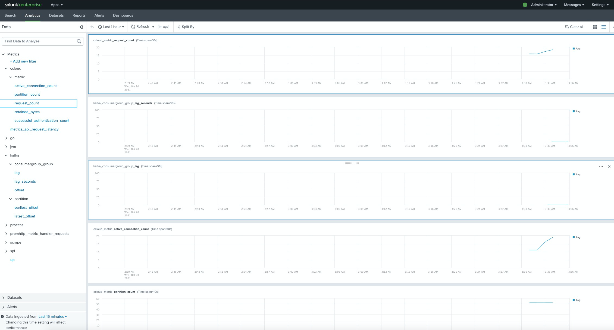

# Prometheus exporter for Confluent Cloud Metrics API

A simple Prometheus exporter that can be used to extract metrics from [Confluent Cloud Metric API](https://docs.confluent.io/current/cloud/metrics-api.html).
By default, the exporter will be exposing the metrics on [port 2112](http://localhost:2112).  When launching with Docker Compose, metrics are displayed via a Grafana dashboard on [http://localhost:3000](http://localhost:3000) (`admin`/`admin`).

To use the exporter, the following environment variables need to be specified:

* `CCLOUD_API_KEY`: The API Key created with `ccloud api-key create --resource cloud`
* `CCLOUD_API_SECRET`: The API Key Secret created with `ccloud api-key create --resource cloud`

`CCLOUD_API_KEY` and `CCLOUD_API_SECRET` environment variables will be used to invoke the https://api.telemetry.confluent.cloud endpoint.

## Usage

```shell
./ccloudexporter [-cluster <cluster_id>] [-connector <connector_id>] [-ksqlDB <app_id>] [-schemaRegistry <sr_id>]
```

### Options

```
Usage of ./ccloudexporter:
  -cluster string
    	Comma separated list of cluster ID to fetch metric for. If not specified, the environment variable CCLOUD_CLUSTER will be used
  -config string
    	Path to configuration file used to override default behavior of ccloudexporter
  -connector string
    	Comma separated list of connector ID to fetch metric for. If not specified, the environment variable CCLOUD_CONNECTOR will be used
  -delay int
    	Delay, in seconds, to fetch the metrics. By default set to 120, this, in order to avoid temporary data points. (default 120)
  -endpoint string
    	Base URL for the Metric API (default "https://api.telemetry.confluent.cloud/")
  -granularity string
    	Granularity for the metrics query, by default set to 1 minutes (default "PT1M")
  -ksqlDB string
    	Comma separated list of ksqlDB application to fetch metric for. If not specified, the environment variable CCLOUD_KSQL will be used
  -schemaRegistry string
    	Comma separated list of Schema Registry ID to fetch metric for. If not specified, the environment variable CCLOUD_SCHEMA_REGISTRY will be used
  -listener string
    	Listener for the HTTP interface (default ":2112")
  -log-pretty-print
    	Pretty print the JSON log output (default true)
  -no-timestamp
    	Do not propagate the timestamp from the the metrics API to prometheus
  -timeout int
    	Timeout, in second, to use for all REST call with the Metric API (default 60)
  -verbose
    	Print trace level logs to stdout
  -version
    	Print the current version and exit
```

## Examples

### Building and executing

```shell
go get github.com/Dabz/ccloudexporter/cmd/ccloudexporter
go install github.com/Dabz/ccloudexporter/cmd/ccloudexporter
export CCLOUD_API_KEY=ABCDEFGHIKLMNOP
export CCLOUD_API_SECRET=XXXXXXXXXXXXXXXX
./ccloudexporter -cluster lkc-abc123
```

### Using Docker

```shell
docker run \
  -e CCLOUD_API_KEY=$CCLOUD_API_KEY \
  -e CCLOUD_API_SECRET=$CCLOUD_API_SECRET \
  -e CCLOUD_CLUSTER=lkc-abc123 \
  -p 2112:2112 \
  dabz/ccloudexporter:latest
```

### Using Docker Compose

```shell
export CCLOUD_API_KEY=ABCDEFGHIKLMNOP
export CCLOUD_API_SECRET=XXXXXXXXXXXXXXXX
export CCLOUD_CLUSTER=lkc-abc123
docker-compose up -d
```
In addition to the metrics exporter and Prometheus containers, the Docker Compose launch starts a [Grafana](https://github.com/grafana/grafana) on [http://localhost:3000](http://localhost:3000) (`admin`/`admin`).  The launch pre-provisions a Prometheus datasource for the Confluent Cloud metrics and a default dashboard.

The Docker Compose service definitions include data volumes for both Prometheus and Grafana, so metrics data will be retained following `docker-compose down` and restored when containers are started again. To remove these volumes and start with empty Prometheus and Grafana databases, run `docker-compose down --volumes`.

### Using Kubernetes

Kubernetes deployment with Prometheus Operator.
These following lines assume there is Prometheus Operator already running in the cluster with `label: release=monitoring`.
Add the list of cluster ids separated by spaces in `./kubernetes/ccloud_exporter.env`, for example: `CCLOUD_CLUSTERS=<cluster_id1> <cluster_id2> ...`.

```shell
cp ./ccloud_exporter.env-template ./kubernetes/ccloud_exporter.env
cd ./kubernetes
vim ./ccloud_exporter.env
make install
```

> A Deployment and a Service object are deployed to a unique namespace.
A ServiceMonitor CRD is deployed to the Prometheus Operator namespace.

To delete deployment: `cd ./kubernetes && make remove`

## Configuration file

For more advanced deployment, you could specify a YAML configuration file with the `-config` flag.
If you do not provide a configuration file, the exporter creates one from the provided flags.

### Configuration

#### Global configuration

| Key                 | Description                                                                                                   | Default value                          |
|---------------------|---------------------------------------------------------------------------------------------------------------|----------------------------------------|
| config.http.baseurl | Base URL for the Metric API                                                                                   | https://api.telemetry.confluent.cloud/ |
| config.http.timeout | Timeout, in second, to use for all REST call with the Metric API                                              | 60                                     |
| config.listener     | Listener for the HTTP interface                                                                               | :2112                                  |
| config.noTimestamp  | Do not propagate the timestamp from the metrics API to prometheus                                             | false                                  |
| config.delay        | Delay, in seconds, to fetch the metrics. By default set to 120, this, in order to avoid temporary data points | 120                                    |
| config.granularity  | Granularity for the metrics query, by default set to 1 minute                                                 | PT1M                                   |
| rules               | List of rules that need to be executed to fetch metrics                                                       |                                        |

#### Rule configuration

| Key                    | Description                                                                                                   |
|------------------------|---------------------------------------------------------------------------------------------------------------|
| rules.clusters         | List of Kafka clusters to fetch metrics for                                                                   |
| rules.connectors       | List of connectors to fetch metrics for                                                                       |
| rules.ksqls            | List of ksqlDB applications to fetch metrics for                                                              |
| rules.schemaRegistries | List of Schema Registries id to fetch metrics for                                                              |
| rules.labels           | Labels to exposed to Prometheus and group by in the query                                                     |
| rules.topics           | Optional list of topics to filter the metrics                                                                 |
| rules.metrics          | List of metrics to gather                                                                                     |

### Examples of configuration files

- A simple configuration to fetch metrics for a cluster: [simple.yaml](./config/config.simple.yaml)
- A configuration to fetch metrics at the partition granularity for a few topics: [partition.yaml](./config/config.partition.yaml)

### Default configuration

```yaml
config:
  http:
    baseurl: https://api.telemetry.confluent.cloud/
    timeout: 60
  listener: 0.0.0.0:2112
  noTimestamp: false
  delay: 60
  granularity: PT1M
rules:
  - clusters:
      - $CCLOUD_CLUSTER
    connectors:
      - $CCLOUD_CONNECTOR
    ksqls:
      - $CCLOUD_KSQL
    schemaRegistries:
      - $CCLOUD_SCHEMA_REGISTRY
    metrics:
      - io.confluent.kafka.server/received_bytes
      - io.confluent.kafka.server/sent_bytes
      - io.confluent.kafka.server/received_records
      - io.confluent.kafka.server/sent_records
      - io.confluent.kafka.server/retained_bytes
      - io.confluent.kafka.server/active_connection_count
      - io.confluent.kafka.server/request_count
      - io.confluent.kafka.server/partition_count
      - io.confluent.kafka.server/successful_authentication_count
      - io.confluent.kafka.connect/sent_bytes
      - io.confluent.kafka.connect/received_bytes
      - io.confluent.kafka.connect/received_records
      - io.confluent.kafka.connect/sent_records
      - io.confluent.kafka.connect/dead_letter_queue_records
      - io.confluent.kafka.ksql/streaming_unit_count
      - io.confluent.kafka.schema_registry/schema_count
    labels:
      - kafka_id
      - topic
      - type
```

### Limits

In order to avoid reaching the limit of 1,000 points set by the Confluent Cloud Metrics API, the following soft limits has been established in the exporter:

- In order to group by partition, you need to specify one or multiple topics
- You cannot specify more than 100 topics in a single rule
- `clusters`, `labels` and `metrics` are required in each rule

## How to build

```
go get github.com/Dabz/ccloudexporter/cmd/ccloudexporter
```

## Grafana

A Grafana dashboard is provided in [./grafana/](./grafana) folder.


# Deprecated configuration

## cluster_id is deprecated

Historically, the exporter and the Metrics API exposed the ID of the cluster with the label `cluster_id`.
In the Metrics API V2, this label has been renamed to `resource.kafka.id`. It is now exposed by the exporter as `kafka_id` instead.

To avoid breaking previous dashboard, the exporter is exposing, for the moment, the ID of the cluster as `cluster_id` and `kafka_id`.

## Username/Password authentication is deprecated

In previous versions, it was possible to rely on username/password to authenticate to Confluent Cloud.
Nowadays, only the API key/secret is officially supported to connect to the Metrics API.

To ensure backward compatibility, previous environment variables are still available.
Nonetheless, username/password is now **deprecated** and you **must** rely on API key/secret.

# Integrations

In real world, customers would want to integrate with their existing logging, monitoring and alerting solutions. Here, we're trying to accommodate as many tooling examples as possible to showcase how the Metrics API can be integrated with.

## Splunk
Let's take a look at how to see the cloud metrics on Splunk dashboard. Let's create a docker-compose yaml to include:
* cclouder exporter image itself to pull metrics from the CCloud MetricsAPI
* Splunk's Open Telemetry Collector that'd scrape from Prometheus' /metrics endpoint housed inside the cclouder exporter container
* Splunk standalone container to receive the metrics
* This set up is done by tweaking the needed details [here](https://github.com/signalfx/splunk-otel-collector/tree/main/examples/prometheus-federation) 

### How to run 
* Run the [docker.compose.yaml](./integration/splunk/docker-compose.yml) using command docker-compose up --build
* Check analytics workspace [here](http://localhost:18000/en-US/app/search/analytics_workspace)
* Metrics will show up like this:



# See Also

For a tutorial that showcases how to use ccloudexporter, and steps through various failure scenarios to see how they are reflected in the provided metrics, see the [Observability for Apache Kafka® Clients to Confluent Cloud tutorial](https://docs.confluent.io/platform/current/tutorials/examples/ccloud-observability/docs/observability-overview.html).


