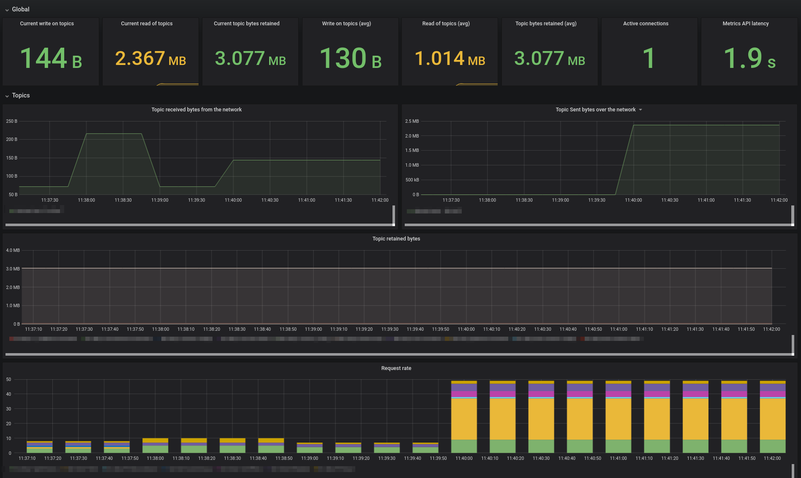

# Important information

In previous versions, it was possible to rely on username/password to authenticate to Confluent Cloud.
Nowadays, only the API key/secret is officially supported to connect to the Metrics API.

To ensure backward compatibility, previous environment variables are still available.
Nonetheless, username/password is now **deprecated** and you **must** rely on API key/secret.

# Prometheus exporter for Confluent Cloud Metrics API

A simple prometheus exporter that can be used to extract metrics from [Confluent Cloud Metric API](https://docs.confluent.io/current/cloud/metrics-api.html).
By default, the exporter will be exposing the metrics on [port 2112](http://localhost:2112)
To use the exporter, the following environment variables need to be specified:

* `CCLOUD_API_KEY`: The API Key created with `ccloud api-key create --resource cloud`
* `CCLOUD_API_SECRET`: The API Key Secret created with `ccloud api-key create --resource cloud`

`CCLOUD_API_KEY` and `CCLOUD_API_SECRET` environment variables will be used to invoke the https://api.telemetry.confluent.cloud endpoint.

## Usage
```
./ccloudexporter -cluster <cluster_id>
````

### Options

```
Usage of ./ccloudexporter:
  -cluster string
    	Cluster ID to fetch metric for. If not specified, the environment variable CCLOUD_CLUSTER will be used
  -config string
    	Path to configuration file used to override default behavior of ccloudexporter
  -delay int
    	Delay, in seconds, to fetch the metrics. By default set to 120, this, in order to avoid temporary data points. (default 120)
  -endpoint string
    	Base URL for the Metric API (default "https://api.telemetry.confluent.cloud/")
  -granularity string
    	Granularity for the metrics query, by default set to 1 minutes (default "PT1M")
  -listener string
    	Listener for the HTTP interface (default ":2112")
  -no-timestamp
    	Do not propagate the timestamp from the the metrics API to prometheus
  -timeout int
    	Timeout, in second, to use for all REST call with the Metric API (default 60)
  -version
    	Print the current version and exit
```

## Examples

### Building and executing
```shell script
go get github.com/Dabz/ccloudexporter/cmd/ccloudexporter
go install github.com/Dabz/ccloudexporter/cmd/ccloudexporter
export CCLOUD_API_KEY=ABCDEFGHIKLMNOP
export CCLOUD_API_SECRET=XXXXXXXXXXXXXXXX
./ccloudexporter -cluster lkc-abc123
```

### Using docker
```shell script
docker run \
  -e CCLOUD_API_KEY=$CCLOUD_API_KEY \
  -e CCLOUD_API_SECRET=$CCLOUD_API_SECRET
  -e CCLOUD_CLUSTER=lkc-abc123
  -p 2112:2112
  dabz/ccloudexporter:latest
```

### Using docker-compose
```shell script
export CCLOUD_API_KEY=ABCDEFGHIKLMNOP
export CCLOUD_API_SECRET=XXXXXXXXXXXXXXXX
export CCLOUD_CLUSTER=lkc-abc123
docker-compose up -d
```

## Configuration file

For more advanced deployment, you could specify a YAML configuration file with the `-config` flag.
If you do not provide a configuration file, the exporter creates one from the provided flags.

### Configuration

#### Global configuration

| Key                 | Description                                                                                                   | Default value                          |
|---------------------|---------------------------------------------------------------------------------------------------------------|----------------------------------------|
| config.http.baseurl | Base URL for the Metric API                                                                                   | https://api.telemetry.confluent.cloud/ |
| config.http.timeout | Timeout, in second, to use for all REST call with the Metric API                                              | 60                                     |
| config.listener     | Listener for the HTTP interface                                                                               | :2112                                  |
| config.noTimestamp  | Do not propagate the timestamp from the metrics API to prometheus                                             | false                                  |
| config.delay        | Delay, in seconds, to fetch the metrics. By default set to 120, this, in order to avoid temporary data points | 120                                    |
| config.granularity  | Granularity for the metrics query, by default set to 1 minute                                                 | PT1M                                   |
| rules               | List of rules that need to be executed to fetch metrics                                                       |                                        |

#### Rule configuration

| Key                | Description                                                                                                   |
|--------------------|---------------------------------------------------------------------------------------------------------------|
| rules.clusters     | List of clusters to fetch metrics from                                                                        |
| rules.labels       | Labels to exposed to Prometheus and group by in the query                                                     |
| rules.topics       | Optional list of topics to filter the metrics                                                                 |
| rules.metrics      | List of metrics to gather                                                                                     |

### Examples of configuration files

- A simple configuration to fetch metrics for a cluster: [simple.yaml](./config/config.simple.yaml)
- A configuration to fetch metrics at the partition granularity for a few topics: [partition.yaml](./config/config.partition.yaml)

### Default configuration

```yaml
config:
  http:
    baseurl: https://api.telemetry.confluent.cloud/
    timeout: 60
  listener: 0.0.0.0:2112
  noTimestamp: false
  delay: 60
  granularity: PT1M
rules:
  - clusters:
      - $CCLOUD_CLUSTER
    metrics:
      - io.confluent.kafka.server/received_bytes
      - io.confluent.kafka.server/sent_bytes
      - io.confluent.kafka.server/received_records
      - io.confluent.kafka.server/sent_records
      - io.confluent.kafka.server/retained_bytes
      - io.confluent.kafka.server/active_connection_count
      - io.confluent.kafka.server/request_count
      - io.confluent.kafka.server/partition_count
    labels:
      - cluster_id
      - topic
      - type
```

### Limits

In order to avoid reaching the limit of 1,000 points set by the Confluent Cloud Metrics API, the following soft limits has been established in the exporter:

- In order to group by partition, you need to specify one or multiple topics
- You cannot specify more than 100 topics in a single rule
- `clusters`, `labels` and `metrics` are required in each rule

## How to build
```
go get github.com/Dabz/ccloudexporter/cmd/ccloudexporter
```

## Grafana
A Grafana dashboard is provided in [./grafana/](./grafana) folder.


